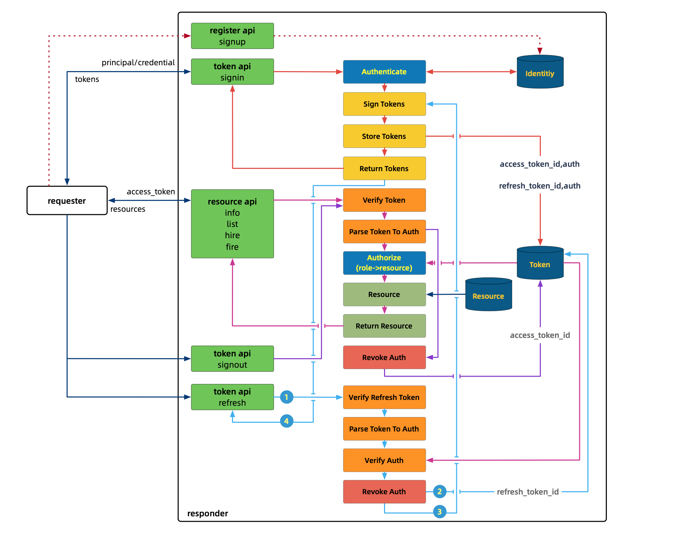

# KIO
kio is a secure io demonstration, for Token-based RSocket Communication.

## Feature

- [x] program language-agnostic interface
- [x] authentication and authorization
- [x] versioning api
- [ ] tracing and accounting
- [ ] status code
- [ ] blacklist

## Design

| api     | description    | interaction model | role          |
| :------ | :------------- | :---------------- | :------------ |
| signin  | take and authenticate principal/credential, sign, save and return Access Token and Refresh Token | Request/Response  | all|
| signout | take and verify Access Token from Header, revoke it from DB  | Fire-and-Forget   | authenticated |
| refresh | take and verify Refresh Token from payload, sign, save and return Access Token and Refresh Token | Request/Response  | all|
| info    | take and verify Access Token from Header, authorize and return employee  info | Request/Response  | user,admin    |
| list    | take and verify Access Token from Header, authorize and return list of employee | Request/Stream    | user,admin    |
| hire    | take and verify Access Token from Header, authorize and save new employee | Request/Response  | admin         |
| fire    | take and verify Access Token from Header, authorize and remove the employee | Request/Response  | admin         |

## Workflow



##### ports

- webflux: http 8989
- rsocket: tcp  7878

## Development
### Coding
- [x] Java/SpringBoot
- [x] Golang
- [ ] Rust
- [ ] Nodejs

### Building
> choose either of them
>
>  [just](https://github.com/casey/just) needs additional installation (`brew install just`)

- `bash build.sh`
- `just b`

### Running


#### responder

- `bash start_responder.sh`
- `just s`

#### requester [java]
- `bash run_requester.sh`
- `just q`

### Testing
```bash
curl_test.sh
```
